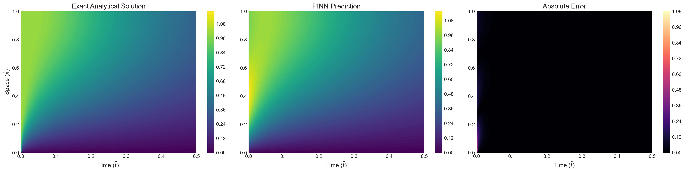
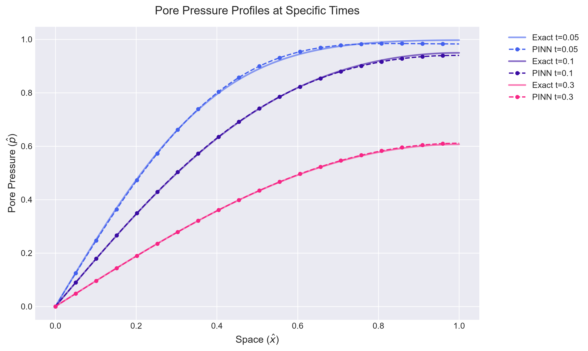
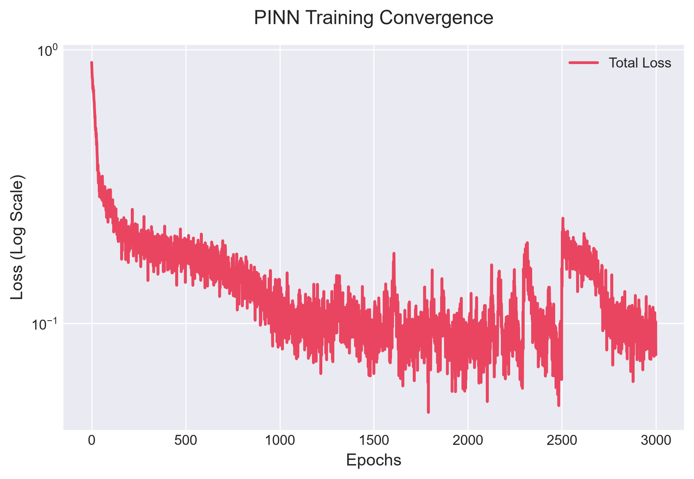

<div align="center">

# 🧠 Physics-Informed Neural Networks (PINNs)
**Machine Learning Mini-Project**

[](https://pytorch.org/)
[](https://www.python.org/)
[](https://opensource.org/licenses/MIT)

*Solving the 1D Consolidation / Diffusion PDE using deep learning and physical laws.*

</div>

<br />

## 📖 Overview

This repository contains a PyTorch implementation of a **Physics-Informed Neural Network (PINN)** to solve the 1D consolidation (diffusion) problem. Traditional Neural Networks rely entirely on large, labeled datasets. PINNs, on the other hand, encode the governing Physical Laws (Partial Differential Equations) directly into the loss function, allowing them to solve complex systems in a completely **mesh-free and data-free** (unsupervised) manner!

### The Governing Equation

We aim to find the dimensionless pore pressure field $\hat{p}(\hat{x}, \hat{t})$ governed by:

$$ \frac{\partial \hat{p}}{\partial \hat{t}} - \frac{\partial^2 \hat{p}}{\partial \hat{x}^2} = 0 \quad \text{for } 0 < \hat{x} < 1, \hat{t} > 0 $$

---

## 🚀 Features & Implementation

- **Fully Connected MLP**: 5 hidden layers (50 neurons each) using `Tanh` activation.
- **Automatic Differentiation (Autograd)**: Computes precise spatial and temporal derivatives to penalize the PDE residual.
- **Hard Constraints**: The network prediction is multiplied by $\hat{x}$ (i.e. $\hat{p}_{pred} = \hat{x} \cdot N(\hat{x}, \hat{t})$) to strictly enforce the Dirichlet boundary condition $\hat{p}(0, \hat{t}) = 0$.

---

## 📊 Results & Visualizations

During training, the model evaluates its predictions against the exact analytical Fourier series solution. The graphs below are generated automatically upon training.

### 1. Spatio-Temporal Pressure Field
The PINN learns the continuous field solution mapping accurately to the exact solution. Notice the near-zero absolute error!

<div align="center">
  
</div>

### 2. Cross-Sectional Profiles over Time
A slice of the pressure profile at specific time steps ($t=0.05, 0.1, 0.3$). The PINN predictions (dashed lines with markers) perfectly track the true analytical decay over time (solid lines).

<div align="center">
  
</div>

### 3. Training Convergence
The total loss is a composite of the PDE residual loss, the Initial Condition loss, and the Boundary Condition loss.

<div align="center">
  
</div>

---

## 💻 Quick Start Guide

### 1. Project Structure
```text
ml_mini_project/
├── assets/                  # Generated graphs and visualizations
├── src/
│   └── pinn.py              # Main model and training loop
├── requirements.txt         # Python dependencies
├── README.md                # Project documentation
└── writeup.md               # Summary report 
```

### 2. Installation
Ensure you have Python 3.8+ installed. Clone the repository and install dependencies:

```bash
git clone <your-private-repo-url>
cd ml_mini_project
pip install -r requirements.txt
```

### 3. Running the Model
Train the neural network and automatically generate the result graphs in the `assets/` folder:

```bash
python src/pinn.py
```

---
*Reference: Based on "DATA DRIVEN SOLUTIONS AND DISCOVERIES IN MECHANICS USING PHYSICS INFORMED NEURAL NETWORK" (Zhang, Chen, Yang).*
